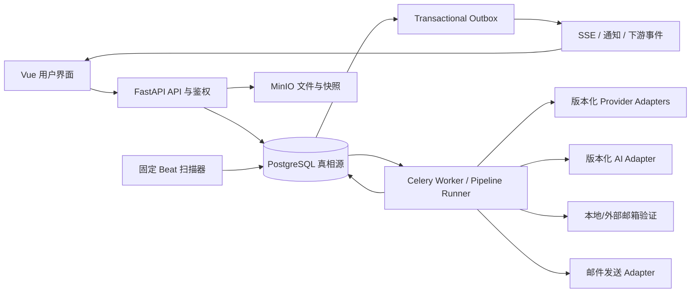

# BuyerReach 后续版本最终开发技术方案 V1

状态：后续开发总基线
日期：2026-07-21
适用版本：V1.5–V3.0
适用工具：VS Code、Codex、Claude Code、Cursor、GitHub Copilot 及人工开发

## 1. 文档定位

本文是 BuyerReach 后续版本开发的总入口，统一以下设计：

- 查询切片与持续商家发现；
- 多来源 Provider 接入、切换和免费来源扩展；
- 数据新鲜度、官网复查和邮箱验证；
- AI 辅助筛选、评分、草稿和建议；
- 自动任务、定时任务和自动开发客户；
- 邮件安全、审批、发送、跟进和停止；
- 多用户、组织、团队、权限和审计；
- CRM、客户监控、采购信号与管理分析；
- 多任务并发、恢复、成本、发布和回滚。

本文负责产品顺序、跨域边界、总体架构和发布门。详细字段、状态、API、迁移和验收以专题架构为准。若发生冲突，优先级如下：

1. `docs/DEVELOPMENT_RULES.md`；
2. `docs/pipeline-production-architecture-v1.md`；
3. 本文；
4. 本文引用的专题架构；
5. 实施 Prompt 和编辑器规则。

实现开始前必须同时阅读当前能力边界：`docs/production-integrity-audit-2026-07-17.md`。不得把本文规划描述为已上线能力。

## 2. 最终产品决策

BuyerReach 的主要产品不再是“一次搜索前 100 家商家”，而是一个持续、可控、可解释的自动客户开发系统：

```text
用户定义目标客户
  -> 系统生成可查看的查询切片
  -> 多来源持续发现商家
  -> 官网、公司、联系人和邮箱验证
  -> AI + 确定性规则筛选与排序
  -> 用户处理少量待办
  -> 受控生成、审批、发送和跟进
  -> 回复/退订/投诉立即停止
  -> 合格客户进入 CRM
  -> 定期刷新数据和监控采购信号
```

系统目标是减少用户操作，不是减少用户控制。技术分页、重试、来源切换、并发、恢复和数据复查默认自动完成；目标市场、质量要求、预算、发送权限和高风险审批由用户决定。

## 3. 产品不变量

以下规则在所有版本中必须成立：

1. PostgreSQL 是任务、切片、候选、状态、事件、成本、权限和审计的最终真实来源；
2. Redis/Celery 只负责唤醒和传输，不保存不可恢复的业务真相；
3. 任何来源都不能保证“返回前 N 条就是精准目标客户”，必须通过切片、证据、验证和评分形成漏斗；
4. 不依赖 Hunter 或任何单一接口；Provider 可替换、可并行、可降级；
5. AI 可以生成查询、提取维度、总结证据和生成草稿，但不能虚构来源、验证结果或绕过确定性安全门；
6. 未验证、验证过期、退订、投诉、硬退信或禁止联系的邮箱不得自动发送；
7. 每个外部调用必须有预算、超时、重试上限、幂等和执行记录；
8. 多组织严格隔离，后台任务也必须鉴权；
9. 长任务必须提供真实阶段、部分结果、暂停、恢复、取消和失败原因；
10. 新功能采用可逆迁移和 `disabled -> shadow -> review -> active` rollout；
11. 任何版本回滚不得删除历史证据、消息、回复、成本或审计；
12. 免费来源只在许可、robots、服务条款、访问频率和数据用途允许时使用。

## 4. 用户主流程

### 4.1 首次创建

用户只需完成一个向导：

1. 选择客户画像模板或输入产品、国家、行业、渠道和目标职位；
2. 选择期望返回数量和最低质量等级；
3. 查看系统生成的查询切片，可删除、补充或调整；
4. 选择运行方式：立即一次、每天、每周或自定义；
5. 选择自动化等级：仅草稿、需要审核、受控自动；
6. 确认预算、发送窗口和负责人；
7. 启用。

高级 Provider、并发、misfire、时区、重试和 fallback 使用安全默认值，放入高级设置。

### 4.2 日常使用

用户主要进入两个页面：

- 自动化中心：查看运行、下一次执行、预算、结果和暂停状态；
- 今日待办：处理待批准邮件、风险邮箱、低置信度客户、重要回复和配置异常。

用户不需要逐页驱动 Pipeline。系统提供部分结果，用户可在整个任务完成前开始审核和分配已经合格的客户。

### 4.3 多用户协作

- 数据研究员负责切片和候选质量；
- 自动化管理员负责计划和运行策略；
- Outreach 管理员负责模板、活动和发送安全；
- 审批人处理高风险批准；
- 销售人员只处理分配给本人或团队的客户与回复；
- 管理员管理组织、权限、预算和 Provider；
- 审计人员只读查看执行证据。

岗位模板自动提供最小权限，复杂权限按需展开。

## 5. 总体架构



短期继续采用模块化单体、PostgreSQL、Celery 和现有前后端，不为规划中的规模提前拆微服务。只有容量、独立部署或故障隔离证据充分时才拆分。

## 6. 领域边界

| 领域 | 负责 | 不负责 |
|---|---|---|
| Identity & Access | 组织、用户、团队、角色、数据范围、授权 | 业务评分和发送策略 |
| Discovery | 查询计划、切片、来源命中、商家候选 | 真实邮件发送 |
| Evidence & Verification | 官网证据、公司/联系人/邮箱有效性 | 最终销售评级 |
| Scoring | AI 维度、确定性政策、评级和解释 | 绕过 suppression |
| Automation | 定义、版本、触发、Run、Step、审批编排 | Vendor 私有协议 |
| Outreach | 账户、域名、模板、活动、发送、回复、抑制 | 商家爬取 |
| CRM | 线索、负责人、任务、商机、询盘、样品、报价 | 外部来源访问 |
| Monitoring | 网站快照、变化事件、采购信号 | 自动批准发送 |
| Provider Platform | Credential、Adapter、路由、配额、成本 | 业务状态真相 |
| Audit & Compliance | 操作、来源、导出、审批和安全审计 | 创建业务实体 |

领域通过版本化内部契约、数据库事务和 Outbox 协作。禁止继续扩大单个巨型 service。

## 7. 查询切片与持续发现

### 7.1 为什么必须切片

单个 Provider 的第一页或前 100 条只代表该接口的排序和覆盖，不代表目标市场。系统需要把客户画像转换为多个可观察、可补充、可独立执行的查询切片，例如：

```text
国家 × 行业 × 渠道 × 商业类型 × 关键词组 × 来源能力
```

每个切片有独立状态、返回数量、成本、覆盖和失败原因。跨切片候选按规范化域名、公司身份和证据去重，但保留每个来源命中。

### 7.2 核心模型

- `search_query_plan`：用户目标、期望数量、停止规则、版本；
- `search_query_slice`：规范化条件、优先级、来源能力和用户修改；
- `search_query_slice_run`：一次执行状态、分页游标、数量和成本；
- `discovery_candidate_source_hit`：候选与来源证据；
- `scheduler_capacity_lease`：并发和公平容量。

详细设计以 `docs/query-slicing-production-implementation-plan.md` 为准。

### 7.3 生成与确认

切片由确定性模板先生成，AI 只用于补充同义词、行业表达和长尾建议。系统必须展示：

- 生成理由；
- 预计切片数量，不虚构预计商家总数；
- 包含和排除条件；
- 来源适配情况；
- 用户新增、删除和锁定状态。

用户可以直接使用推荐方案，也可补充切片。再次生成不得覆盖用户锁定的切片。

### 7.4 返回数量和停止条件

用户选择目标数量而不是 Provider 页数。停止条件由以下条件组合：

- 已达到合格唯一商家数量；
- 所有切片耗尽；
- 预算或外部额度耗尽；
- 连续若干页没有新增唯一候选；
- 用户暂停或取消；
- 达到运行时间上限。

页面分别展示发现数、唯一数、已验证数、合格数，不把原始结果数冒充目标客户数。

## 8. 数据来源和 Provider 切换

### 8.1 标准能力契约

Provider 通过能力接入，而不是让业务代码依赖 Vendor 名称：

- `company_search`；
- `directory_search`；
- `website_search`；
- `contact_search`；
- `email_finder`；
- `email_verifier`；
- `website_fetch`；
- `message_send`；
- `message_event`。

每个 Adapter 负责 URL、认证、请求、响应映射、分页、错误和 Provider 原生幂等。业务层只接收标准结果。

### 8.2 可优先使用的免费方式

第一阶段优先接入无需购买数据许可且可以合规使用的方式：

- 搜索引擎公开结果的官方 API 免费额度或自建可许可搜索入口；
- 政府、开放数据门户和公开企业注册数据；
- 行业协会、展会和会员目录中允许访问的公开页面；
- 品牌集合站、购物中心目录和经销商目录；
- 企业官网的 About、Contact、Stockists、Store Locator、News、Careers；
- 用户上传 CSV/XLSX 和人工补充；
- 已获取数据的定期官网复查；
- 本地邮箱语法、域名、MX、临时邮箱和受控 SMTP 信号验证。

“免费”不等于无限抓取。每个来源需要记录许可类型、robots 策略、访问频率、证据 URL、抓取时间、保留策略和停用开关。不允许绕过登录、验证码、付费墙或反爬保护。

### 8.3 路由和降级

Provider Router 根据冻结的 `TaskVendorPlan` 执行：

1. 校验启用状态、Credential、额度和熔断；
2. 按能力、国家、成本、质量和优先级选择；
3. 空结果、额度耗尽、可重试错误或 `unknown` 时按策略切换；
4. 保存每次尝试、跳过理由、成本和原始证据引用；
5. 所有可用来源失败时返回可解释的“来源不可用”，不返回伪造数据。

## 9. 数据质量、验证和 AI

### 9.1 数据新鲜度

公司、官网、联系人、邮箱和证据分别保存：

- `observed_at`、`verified_at`、`expires_at`；
- 来源、方法、置信度和版本；
- 当前值与不可变历史；
- stale、unknown、conflict 状态。

周期任务只复查已过期或政策要求复查的数据，避免重复消耗。

### 9.2 邮箱验证

本地验证服务负责格式、域名、MX、临时邮箱、角色邮箱和受控 SMTP 信号，详细方案见 `docs/email-verifier-production-plan.md`。

标准结果：`valid`、`invalid`、`risky`、`catch_all`、`unknown`、`do_not_contact`。本地 `unknown` 或策略允许的风险结果可切换外部验证 Provider。验证不可用时显示待验证，不得默认有效。

### 9.3 AI 的允许边界

AI 可用于：

- 查询切片和关键词建议；
- 官网内容结构化提取；
- 行业、品类、渠道和商业类型维度判断；
- 证据摘要和冲突提示；
- 个性化邮件草稿；
- 回复分类和建议动作；
- 采购信号摘要。

AI 不可用于：

- 伪造商家、联系人、邮箱或来源；
- 将猜测邮箱标记为验证有效；
- 直接计算不可解释的最终等级；
- 绕过人工禁止、退订、投诉、预算或权限；
- 在没有真实证据时声称了解客户业务。

AI Adapter 输出维度和证据判断，确定性 Policy 负责阈值、硬规则和 A/B/C/D。Prompt、模型、Policy、知识、模板和输出 Schema 独立版本化。

## 10. 自动化控制平面

### 10.1 核心模型

- `automation_definition`：稳定身份和所有权；
- `automation_version`：不可变业务配置；
- `automation_trigger`：时间或事件触发；
- `automation_run`：一次完整运行；
- `automation_step_run`：每个可恢复动作；
- `automation_approval`：绑定不可变版本的批准；
- `automation_principal`：组织级受限服务身份。

详细设计见 `docs/customer-development-automation-architecture-v1.md`。

### 10.2 调度方式

用户日程保存在 PostgreSQL，使用 IANA 时区和 UTC 执行时间。Celery Beat 只运行少量固定任务：

- `scan_due_automation_triggers`；
- `recover_expired_automation_leases`；
- `publish_domain_outbox`。

禁止为每个用户任务动态建立 Beat 配置。到期扫描通过数据库 Lease 和唯一触发键创建 Run，重复扫描只创建一次。

### 10.3 自动化等级

| 模式 | 行为 |
|---|---|
| `disabled` | 不产生新 Run |
| `draft_only` | 发现、验证、评分、生成草稿，不真实发送 |
| `review_required` | 用户批准后才发送，默认模式 |
| `guarded_auto` | 仅在锁定质量、安全、权限和预算门内自动发送 |

不提供无保护的 fully autonomous 模式。系统异常、账户健康下降或质量指标越界时自动降级到 `review_required`。

### 10.4 多任务并发与稳定性

容量按以下层级限制：

- 系统；
- 组织；
- 用户/团队；
- Automation；
- Provider；
- Credential；
- 发送账户和域名。

调度采用组织公平队列、优先级和加权轮转，防止单个大任务占满 Worker。每个 Step 有 Lease、超时、重试上限、退避、预算检查和幂等键。Worker 崩溃后从数据库恢复；外部调用结果持久化后才调度下一步。

## 11. 邮件发送与跟进

### 11.1 上线顺序

邮件能力必须按以下顺序交付：

1. Sending Account、Domain、Credential、模板和 suppression；
2. `draft_only` 内部测试；
3. `review_required` 小规模真实发送；
4. Webhook、退信、回复、退订、投诉和停止规则；
5. 低风险 `guarded_auto` 渐进 rollout。

不得先做群发页面再补安全基础。

### 11.2 每封发送前强制检查

- 自动化和组织仍有效；
- Automation Principal 仍有权限；
- 审批仍绑定当前内容和收件人版本；
- suppression、退订、投诉、回复和硬退信状态；
- 邮箱验证未过期且满足策略；
- Sending Account 和 Domain 健康；
- 收件人时区和发送窗口；
- 组织、活动、联系人频率限制；
- Provider 额度和预算；
- 消息幂等键未发送。

任一条件失败都不发送，并记录用户可理解的原因。

### 11.3 停止规则

回复、退订、投诉、硬退信、人工停止、组织 suppression、活动暂停或 CRM 阶段变化必须取消未发送的后续步骤。Out-of-office 可根据返回日期延后；转介绍停止原联系人并创建人工审核任务。

## 12. 多用户和权限

详细设计见 `docs/multi-user-access-control-architecture-v1.md`。

授权决策为：

```text
身份有效
AND 组织成员有效
AND 动作权限
AND 数据范围
AND 对象/业务政策
AND 实时安全禁令未命中
```

采用 RBAC + `self/team/assigned/organization` 数据范围 + 少量对象授权。完整邮箱、回复正文、Credential、成本和导出具有独立敏感权限。

后台定时任务使用 Automation Principal，不长期模拟创建者 Token。真实发送、导出、Credential 使用、提高预算和解除 suppression 在实际执行前重新鉴权。用户停用、创建者离职和权限撤销具有明确的暂停、认领、转交或恢复路径。

guarded_auto、大批量发送、生产 Credential、提高预算、解除 suppression 和大量导出默认禁止申请人自批，并支持双人审批。

## 13. 统一数据和状态策略

### 13.1 版本锁定

任务或 Run 创建时锁定：

- Pipeline、Stage Graph；
- Scoring Policy；
- Prompt 和 AI Model；
- Provider Adapter 和 TaskVendorPlan；
- Evidence/Result Schema；
- Query Plan/Slice Generator；
- Automation、Template、Sequence；
- Approval、Authorization、Budget Policy；
- Credential ID 引用，不含秘密。

运行中系统配置变化不得偷偷改变已锁定语义。实时 suppression、权限禁用、Credential 禁用和安全停机开关拥有更高优先级。

### 13.2 幂等

外部或昂贵 Stage 使用：

```text
task_id + candidate_id + stage_name + stage_version + input_hash
```

Automation Step 使用：

```text
automation_run_id + action_type + subject_id + action_version + input_hash
```

消息发送还必须有稳定 `message_idempotency_key`，并尽量传给支持原生幂等的 Provider。

### 13.3 状态变化

- Candidate 只能通过 `transition_candidate`；
- Task 只能通过 `transition_task`；
- Automation Run、Step、Approval、Message 和 CRM 对象分别使用统一状态机；
- 状态变化与 Outbox 事件在同一事务提交；
- 未知新状态在旧前端安全显示，不导致页面崩溃。

## 14. API 和事件

API 负责身份、权限、输入输出和事务边界，不承载完整流程。新接口采用 `/api/v1` 下的增量资源设计：

- `/query-plans`、`/query-slices`、`/slice-runs`；
- `/automations`、`/automation-runs`、`/approvals`；
- `/sending-accounts`、`/templates`、`/campaigns`、`/messages`；
- `/organizations`、`/memberships`、`/teams`、`/roles`；
- `/leads`、`/opportunities`、`/crm-tasks`；
- `/monitoring-targets`、`/signals`。

事件至少包括：

- Query Plan/Slice/Run 状态；
- Candidate discovered/verified/scored/qualified；
- Automation Run/Step/Approval 状态；
- Message scheduled/sent/delivered/bounced/replied/unsubscribed/complained；
- CRM lead assigned/converted；
- Authorization changed；
- Budget/Provider/Credential blocked。

SSE 是任务中心的增量体验，断线后按事件序号恢复；Polling 保留兼容窗口。事件和 API 只做向后兼容的增量变更。

## 15. 前端信息架构

### 一级导航

- 工作台；
- 自动化中心；
- 商家发现；
- 客户与联系人；
- 邮件活动；
- CRM；
- 监控与信号；
- 今日待办；
- 报表；
- 系统配置。

### 关键体验规则

- 新建自动开发计划使用单一向导；
- 切片可查看、补充、锁定和重排；
- 长任务立即确认，关闭页面不影响执行；
- 展示真实阶段和已测量计数，不显示虚构完成率；
- 部分结果可使用；
- 选择或检查列表时不因实时排序移动当前项目；
- 批量操作预览成功、需审批、无权限和预计成本；
- 权限不足显示原因和申请路径；
- 桌面和窄屏均支持关键流程；
- 空、加载、部分、成功、失败、离线、无权限和未知状态都有明确页面。

## 16. 安全与合规

- 所有查询必须带 organization_id 和数据范围；
- 外部 URL 防 SSRF，限制协议、目标、重定向、响应大小和超时；
- 日志、事件、审计和快照递归脱敏；
- Credential 加密保存，业务快照仅保存 ID；
- 导出文件短期有效、受权访问并记录审计；
- 退订、投诉、人工禁止拥有最高发送阻断优先级；
- 来源页面记录 provenance 和许可政策；
- 生产禁用默认 JWT、默认加密密钥和默认管理员密码；
- 删除和保留策略不能破坏合规证据和历史责任链。

## 17. 可观测性和运营

统一关联标识：

- `trace_id`；
- `organization_id`；
- `task_id`、`query_plan_id`、`slice_run_id`；
- `candidate_id`、`stage_run_id`；
- `automation_run_id`、`automation_step_run_id`；
- `message_id`、`vendor_request_id`。

核心指标：

- 首个候选和首个合格客户时间；
- 切片覆盖、耗尽率、唯一率、合格率；
- Provider 成功、空结果、配额、切换、成本；
- 官网和邮箱验证成功/unknown/过期率；
- Stage 和 Automation Step 排队、运行、重试、Lease 过期；
- 各组织活跃和排队任务、公平性与饱和度；
- 审批等待、发送、送达、退信、回复、退订、投诉；
- 权限拒绝、跨组织尝试、敏感导出；
- 从发现到回复、线索和商机的转化。

关键告警包括 Outbox 堆积、到期触发延迟、Worker 无心跳、Provider 异常、成本突增、发送账户健康下降、投诉率上升、跨组织访问尝试和 migration 失败。

## 18. 最终版本实施顺序

### V1.5A：查询切片闭环

交付：Plan、Slice、Run、切片编辑、数量和筛选、独立分页、多来源桥接、去重证据、并发 Lease、部分结果和任务中心。

限制：不新增真实邮件发送；先接现有 Provider 和许可明确的免费来源。

### V1.5B：数据质量中心

交付：新鲜度、官网复查、邮箱本地验证、验证历史、过期扫描、冲突和质量筛选。

### V1.5C：画像、AI 评分和重算

交付：目标画像、维度提取、确定性评级、评分历史、policy_only 重算、标签和成本解释。

### V1.5D：自动化与权限基础

交付：Automation Definition/Version/Trigger/Run/Step、固定扫描器、时区、misfire、暂停恢复、组织 Membership、统一授权、Automation Principal、自动化中心和今日待办。

第一批消费者只有定期增量发现和官网/邮箱复查，不发送真实客户邮件。

### V2.0A：Outreach 安全基础

交付：Sending Account、Domain 健康、Credential、模板、suppression、审批政策、消息幂等和 Webhook 骨架。

### V2.0B：受控活动和发送

交付：Campaign、Sequence、`draft_only`、`review_required`、批量预览、发送窗口、频率、预算和小规模真实发送。

### V2.0C：事件、回复和 guarded_auto

交付：送达、退信、回复、退订、投诉、停止规则、效果分析，以及通过发布门后的低风险 guarded_auto。

### V2.5：CRM 销售协同

交付：Lead、负责人、任务、时间线、Opportunity、Inquiry、Sample、Quotation 和审批。

### V3.0：监控、采购信号和智能建议

交付：网站快照和变化、采购信号、联系人优先级、相似客户、市场分析和管理驾驶舱。AI 仅提供有证据的建议，不直接越权执行。

详细路线图见 `docs/future-version-development-roadmap-2026-07-21.md`。

## 19. 当前立即执行的开发包

下一步只实施 V1.5A 查询切片纵向切片，原因是它直接解决“前 100 家不精准、数据难持续、用户需要指定数量和筛选”的当前主要问题，同时为多来源和自动化提供第一个真实消费者。

实施范围：

1. additive migration：Query Plan、Slice、Slice Run、Source Hit、Capacity Lease；
2. 后端领域模型、状态机、权限和 API；
3. 确定性切片生成与用户补充；
4. 现有 company_search Adapter 桥接；
5. 切片逐个执行、分页、去重、停止和恢复；
6. 创建任务向导和切片抽屉；
7. SSE/轮询兼容的真实进度；
8. 并发、公平、幂等、权限和迁移测试；
9. disabled/shadow/review/active rollout；
10. 文档、运维和回滚说明。

执行依据：

- 详细方案：`docs/query-slicing-production-implementation-plan.md`；
- 决策记录：`docs/query-slicing-implementation-decisions.md`；
- 可执行 Prompt：`docs/query-slicing-production-implementation-prompt.md`；
- 当前实施状态：`docs/query-slicing-implementation-status.md`。

V1.5A 验收通过前，不并行引入真实邮件发送和完整 CRM，避免业务边界和数据模型同时失控。

## 20. 统一完成定义

每个纵向切片必须完成：

### 产品

- 最短用户路径可完成；
- 长任务有部分结果、暂停、恢复、取消和错误说明；
- 权限和预算不足有清晰下一步。

### 后端

- 领域模型、状态机、事务、API、Worker 和真实运行路径接通；
- 外部操作有幂等、超时、重试、成本和取消检查；
- 数据变化与 Outbox 同事务；
- 跨组织、权限撤销和敏感字段测试通过。

### 数据

- additive migration；
- 现有数据库升级、旧数据读取、降一版、再次升级；
- 全新数据库初始化；
- 回填可恢复、限速和重复执行。

### 前端

- 类型检查和生产构建通过；
- 桌面与窄屏关键路径实测；
- 空、加载、部分、失败、未知和无权限状态检查；
- 键盘、焦点、标签、对比度和非颜色提示检查。

### 运行

- `/health`、`/ready`；
- Worker、Beat、数据库 revision；
- Outbox backlog 和恢复扫描；
- 关键指标和告警可观察；
- rollout 和 rollback 演练。

标准验证命令以 `docs/DEVELOPMENT_RULES.md` 为准。不能执行的项目必须记录原因和剩余风险。

## 21. 跨版本验收基线

1. 用户可选择目标数据量并查看、修改系统生成的切片；
2. Provider 单次只返回 100 条时，系统能通过多个切片和分页持续发现；
3. 重复执行不会重复创建同一候选或重复计费；
4. 一个 Provider 失败、无结果或额度耗尽时按锁定策略切换；
5. 免费来源无权限或不允许抓取时安全跳过并说明；
6. AI 不可用时保留确定性流程，显示待评估而不是伪造评分；
7. 用户关闭浏览器后任务继续，重连后恢复真实状态；
8. 多个组织和多个大任务并发时公平执行且系统不崩溃；
9. Redis/Worker 重启后任务从数据库恢复；
10. 暂停后不创建新昂贵步骤，取消后不再调用 Provider；
11. 自动化停机跨过日程后按 misfire 策略补跑或跳过；
12. 邮箱验证过期阻止发送并创建重验；
13. 回复、退订、投诉和硬退信停止后续邮件；
14. guarded_auto 无独立权限和审批时不能启用；
15. A 组织不能通过 API、SSE、导出或文件链接访问 B 组织数据；
16. 用户停用、离职或权限撤销后自动化按政策暂停、转交或阻塞；
17. 两名用户并发编辑或审批不会静默覆盖或重复执行；
18. 未知新状态不导致旧前端崩溃；
19. rollout 异常可降级或关闭且不删除历史；
20. 日志、事件、快照和审计中不存在明文密钥或不必要 PII。

## 22. 发布与回滚原则

### 发布

1. 备份 PostgreSQL 和对象存储；
2. 运行 migration 演练和兼容测试；
3. 部署支持新旧字段的读写代码；
4. 启动 backfill 和 shadow 对比；
5. 按组织或百分比进入 review；
6. 观察质量、错误、成本、队列和权限指标；
7. 达到明确样本和阈值后进入 active。

### 中止条件

- 数据完整性或跨组织隔离失败；
- migration/backfill 不可恢复；
- 重复计费或重复发送；
- Outbox 持续堆积；
- Provider 成本或失败率异常；
- 发送投诉/退订异常；
- Worker 饱和且恢复扫描持续落后；
- 无法关闭高风险自动化。

### 回滚

- 先将功能切为 disabled/review；
- 停止创建新高风险 Step；
- 回滚应用到兼容版本；
- 必要时只回滚 additive migration 的最后一版；
- 保留新表、历史记录、审计和外部事件；
- 修复后使用原幂等键恢复，不重发已成功消息。

## 23. 权威专题文档索引

| 主题 | 权威文档 |
|---|---|
| 开发规则 | `docs/DEVELOPMENT_RULES.md` |
| 现有 Pipeline | `docs/pipeline-production-architecture-v1.md` |
| 当前生产边界 | `docs/production-integrity-audit-2026-07-17.md` |
| 后续版本路线图 | `docs/future-version-development-roadmap-2026-07-21.md` |
| 查询切片 | `docs/query-slicing-production-implementation-plan.md` |
| 查询切片执行 Prompt | `docs/query-slicing-production-implementation-prompt.md` |
| 本地邮箱验证 | `docs/email-verifier-production-plan.md` |
| 邮箱验证执行 Prompt | `docs/email-verifier-implementation-prompt.md` |
| 自动客户开发 | `docs/customer-development-automation-architecture-v1.md` |
| 多用户权限 | `docs/multi-user-access-control-architecture-v1.md` |

以后新增专题必须先更新本文的依赖顺序和索引，不得创建与现有领域重复的第二套架构。

## 24. 最终设计门结论

- 产品：通过。主流程从一次性搜索转为低操作量、持续自动开发客户。
- 架构：通过。领域边界、数据库真相源、Pipeline、Automation 和 Adapter 责任明确。
- 数据：通过设计门。版本、历史、来源、迁移、保留和回滚已定义。
- 可靠性：通过设计门。幂等、Lease、重试、恢复、取消、公平和过载保护已定义。
- 演进：通过。Provider、AI、Policy、Prompt、Schema、Automation 和权限均可版本化。
- 运维：通过设计门。成本、指标、告警、发布、中止和回滚已定义。
- 安全：通过设计门。租户隔离、权限、Credential、SSRF、PII 和邮件安全已覆盖。
- 体验：通过设计门。低操作向导、部分结果、任务感知、权限和异常状态已覆盖。
- 验证：待各纵向切片通过代码、迁移、运行和 UI 证明。本文不能作为功能已上线证明。

